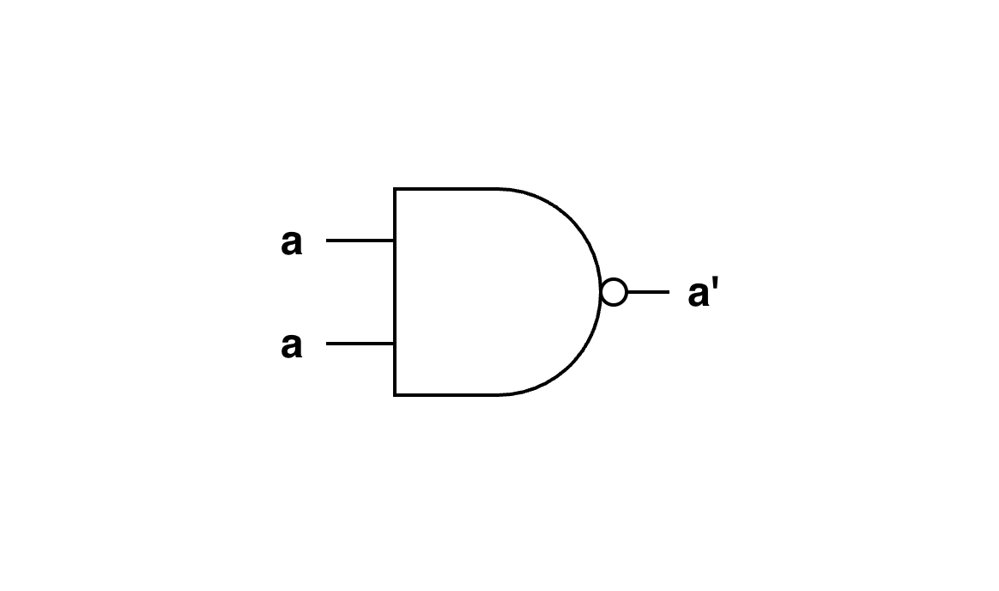

# 1.1 NOT Chip

## Concept

The NOT Chip inverts the input:

- If `in = 1`, then `out = 0`
- If `in = 0`, then `out = 1`

## Truth Table

| in | out |
|:--:|:---:|
| 0  | 1   |
| 1  | 0   |

## Implementation Using Nand Only



**Logic**

```text
inputs: a = in, b = in
output = (in) Nand (in)
       = (in · in)'
       = (in)'
```

**HDL**

```hdl
/**
 * Not Chip:
 * if (in) out = 0, else out = 1
 */
CHIP Not {
    IN in;
    OUT out;

    PARTS:
    Nand(a=in, b=in, out=out);
}
```