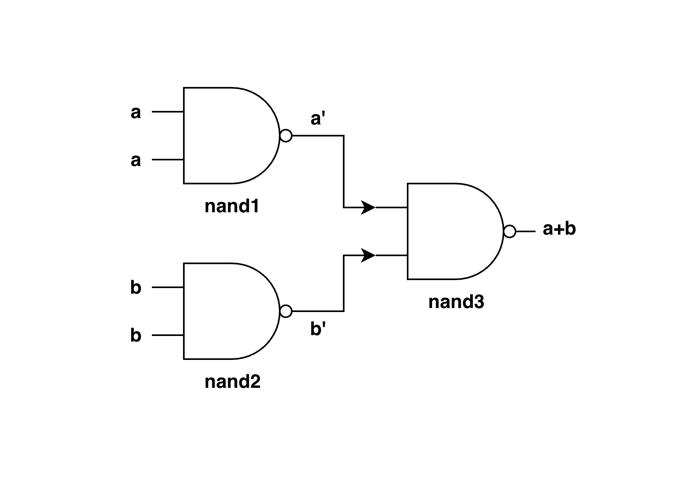

# 1.2 OR Chip

## Concept

The OR Chip performs the logical addition operation between two boolean values:

- If `a = 0`, `b = 0` then `out = 0`
- If `a = 0`, `b = 1` then `out = 1`
- If `a = 1`, `b = 0` then `out = 1`
- If `a = 1`, `b = 1` then `out = 1`

## Truth Table

| a  | b   | out |
|:--:|:---:|:---:|
| 0  | 0   | 0   |
| 0  | 1   | 1   |
| 1  | 0   | 1   |
| 1  | 1   | 1   |

## Implementation Using Nand Only



**Logic**

```text
inputs: a, b

nand1:
    inputs: a = a, b = a
    output = (a) Nand (a) = a'   // as seen in the NOT Chip

nand2:
    inputs: a = b, b = b
    output = (b) Nand (b) = b'   // as seen in the NOT Chip

nand3:
    inputs: a = a', b = b'
    output = (a') Nand (b')
           = (a'b')'
           = (a')' + (b')'      // De Morgan's Second Law: (xy)' = x' + y'
           = a + b              // Double Negation Law: (x')' = x
```

**HDL**

```hdl
/**
 * Or Chip:
 * if (a or b) out = 1, else out = 0
 */
CHIP Or {
    IN a, b;
    OUT out;

    PARTS:
    Nand(a=a, b=a, out=aNand);
    Nand(a=b, b=b, out=bNand);
    Nand(a=aNand, b=bNand, out=out);
}
```