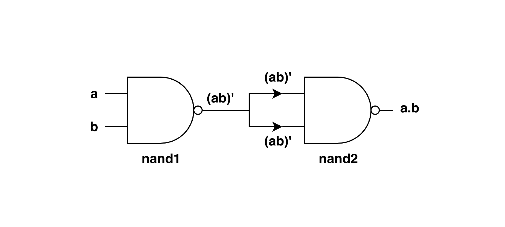

# 1.3 AND Chip

## Concept

The AND Chip performs the logical multiplication operation between two boolean values:

- If `a = 0`, `b = 0` then `out = 0`
- If `a = 0`, `b = 1` then `out = 0`
- If `a = 1`, `b = 0` then `out = 0`
- If `a = 1`, `b = 1` then `out = 1`

## Truth Table

| a  | b   | out |
|:--:|:---:|:---:|
| 0  | 0   | 0   |
| 0  | 1   | 0   |
| 1  | 0   | 0   |
| 1  | 1   | 1   |

## Implementation Using Nand Only



**Logic**

```text
inputs: a, b

nand1:
    inputs: a = a, b = b
    output = (a) Nand (b) = (ab)'

nand2:
    inputs: a = (ab)', b = (ab)'
    output = (ab)' Nand (ab)'
           = [(ab)' . (ab)']'
           = [(ab)']' + [(ab)']'   // De Morgan's Second Law: (xy)' = x' + y'
           = ab + ab                // Double Negation Law: (x')' = x
           = ab                     // Idempotence Law: x + x = x
```

**HDL**

```hdl
/**
 * And Chip:
 * if (a and b) out = 1, else out = 0
 */
CHIP And {
    IN a, b;
    OUT out;

    PARTS:
    Nand(a=a, b=b, out=aNandb);
    Nand(a=aNandb, b=aNandb, out=aNandb_out);
}
```