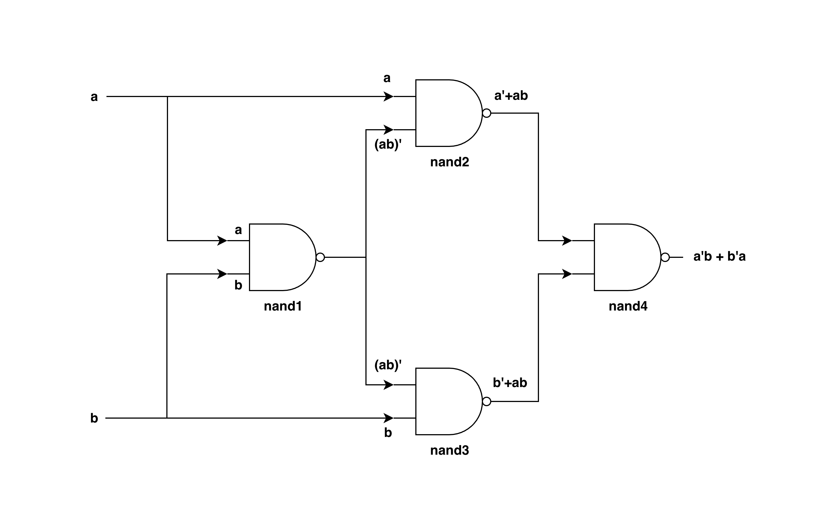

# 1.4 XOR Chip

## Concept

The XOR Chip performs the logical operation `ab'+a'b`

## Truth Table

| a  | b   | out |
|:--:|:---:|:---:|
| 0  | 0   | 0   |
| 0  | 1   | 1   |
| 1  | 0   | 1   |
| 1  | 1   | 0   |

## Implementation Using Nand Only



**Logic**

```text
inputs: a, b

nand1:
    inputs: a = a, b = b
    output = (a) Nand (b) = (ab)'

nand2:
    inputs: a = a, b = (ab)'
    output = (a) Nand (ab)'
           = [(a)(ab)']'
           = a' + [(ab)']' // De-Morgan's Second Law: (ab)' = a' + b'
           = a' + ab // Double Negation Law: (a')' = a

nand3:
    inputs: a = (ab)', b = b
    output = (ab)' Nand b
           = [(ab)'b]'
           = [(ab)']' + b // De-Morgan's Second Law: (ab)' = a' + b'
           = ab + b // Double Negation Law: (a')' = a

nand4:
    inputs: a = a'+ab, b = b'+ab
    output = (a'+ab) Nand (b'+ab)
           = [(a'+ab)(b'+ab)]'
           = (a'+ab)' + (b'+ab)' // De-Morgan's Second Law: (ab)' = a' + b'
           = (a')'.(ab)' + (b')'.(ab)' 
           = a.(ab)' + b.(ab)' // Double Negation Law: (a')' = a
           = a(a'+b') + b(a'+b') // De-Morgan's Second Law: (ab)' = a' + b'
           = aa' + ab' + ba' + bb'
           = ab' + ba' // Inverse Law: xx' = 0

```

**HDL**

```hdl
CHIP Xor{
    IN a,b;
    OUT out;

    PARTS:
    Nand(a=a,b=b,out=aNb);
    Nand(a=a,b=aNb,out=aNaNb);
    Nand(a=aNb,b=b,out=bNaNb);
    Nand(a=aNaNb,b=bNaNb,out=out);
}
```