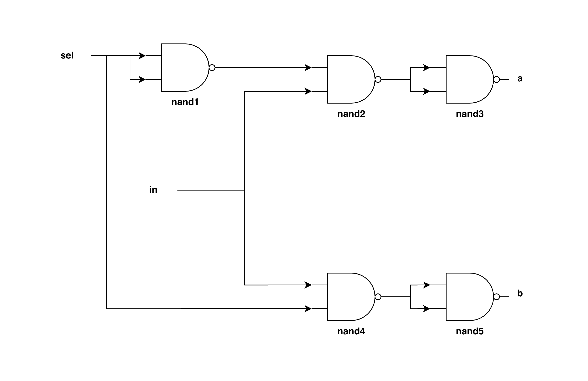

# 1.6 DMux Gate

## Concept

The DMux gate is the inverse of Mux — it acts as a hardware switch, routing a single input to one of two outputs depending on sel. It implements a = in·sel' and b = in·sel.

## Truth Table

| in | sel | a | b |
|:--:|:--:|:--:|:--:|
| 0 | 0 | 0 | 0 |
| 0 | 1 | 0 | 0 |
| 1 | 0 | 1 | 0 |
| 1 | 1 | 0 | 1 |

## Implementation Using Not and And Gates



**Logic**

```text
inputs: in, sel

outputs:
    for a:
        with nand1,
        output = (sel) Nand (sel)
        = sel'

        with nand2,
        output = (sel)' Nand (in) 
        = (sel'.in)'
        
        with nand3,
        output = [(sel'.in)']'
        = sel'.in
        = a
    
    for b:
        with nand4,
        output = (in) Nand (sel)
        = (in.sel)'

        with nand5,
        output = (in.sel)' Nand (in.sel)'
        = in.sel
        = b
```

**HDL**

```hdl
CHIP DMux {
    IN in, sel;
    OUT a, b;

    PARTS:
    Nand(a=sel,b=sel,out=nsel);
    Nand(a=nsel,b=in,out=nselNin);
    Nand(a=nselNin,b=nselNin,out=a);
    Nand(a=in,b=sel,out=inNsel);
    Nand(a=inNsel,b=inNsel,out=b);
}
```